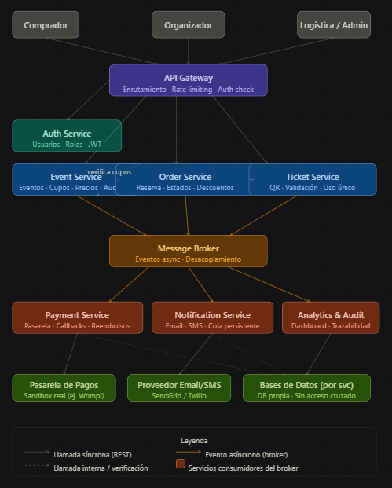

# VivaEventos — Documentación de Arquitectura de Microservicios

## 📁 Estructura del Repositorio 
### - Kubernetes
### - Keycloak
### - RabbitMQ
### - Despliegue en GCP
### - Imágenes de Docker Hub: https://hub.docker.com/repositories/danielgomezcano
### - Multirepo
### - Decisión final del checkout y pagos: Stripe

Los microservicios convivirán en este repositorio, cada uno en su propia carpeta con responsabilidades bien definidas. Esto puede cambiar en la próxima sesión con el profesor:

| Carpeta | Descripción | Puertos |
|---|---|---|
| [/auth-service](https://github.com/daniel-gomez-cano/d3-auth-service) | Gestión de usuarios, roles y permisos. Emisión y validación de tokens JWT. | 8081 |
| [/event-service](https://github.com/daniel-gomez-cano/d3-event-service) | Creación de eventos, tipos de boleta, cupos, precios y códigos promocionales. | 8082 |
| [/order-service](https://github.com/daniel-gomez-cano/d3-order-service) | Flujo de compra: reserva temporal de cupos, descuentos y estados de orden. | 8083 |
| [/payment-service](https://github.com/daniel-gomez-cano/d3-payment-service) | Integración con pasarela de pagos, webhooks, reconciliación y reembolsos. | 8084 |
| [/ticket-service](https://github.com/daniel-gomez-cano/d3-ticket-service) | Generación de boletas digitales con QR único y validación en puerta. | 8085 |
| [/notification-service](https://github.com/daniel-gomez-cano/d3-notification-service) | Envío asíncrono de correos y mensajes (confirmación, recordatorio, cancelación). | 8086 |
| [/analytics-audit-service](https://github.com/daniel-gomez-cano/d3-analytics-audit-service) | Dashboard en tiempo real para el gerente y log inmutable de auditoría. | 8087 |
| [/KEYCLOAK]() | Keycloack gestión de usuarios | 8080 |
| [/RABBITMQ]() | Cola de espera intermedia entre order-service y payment-service | 8090 |

---

## 🏛️ Descripción General de la Arquitectura

Se empleará una arquitectura de microservicios con los principios de base de datos por servicio, comunicación mixta (síncrona y asíncrona) y escalabilidad horizontal independiente por componente.

>Este diagrama de componentes lo hicimos a modo de boceto, Claude nos ayudó a generar la imagen. Este cambiará según recomendaciones del profesor.

---

## 👥 Equipo

| Nombre    | Correo |
|----------------|----------------|
| Daniel Gómez Cano         | daniel.gomez.cano@correounivalle.edu.co |
|Santiago Avalo Monsalve | avalo.santiago@correounivalle.edu.co |
|Edward Stivens Pinto Granados| edward.pinto@correounivalle.edu.co |
|Moises Uriel Medina Villa | moises.medina@correounivalle.edu.co |
